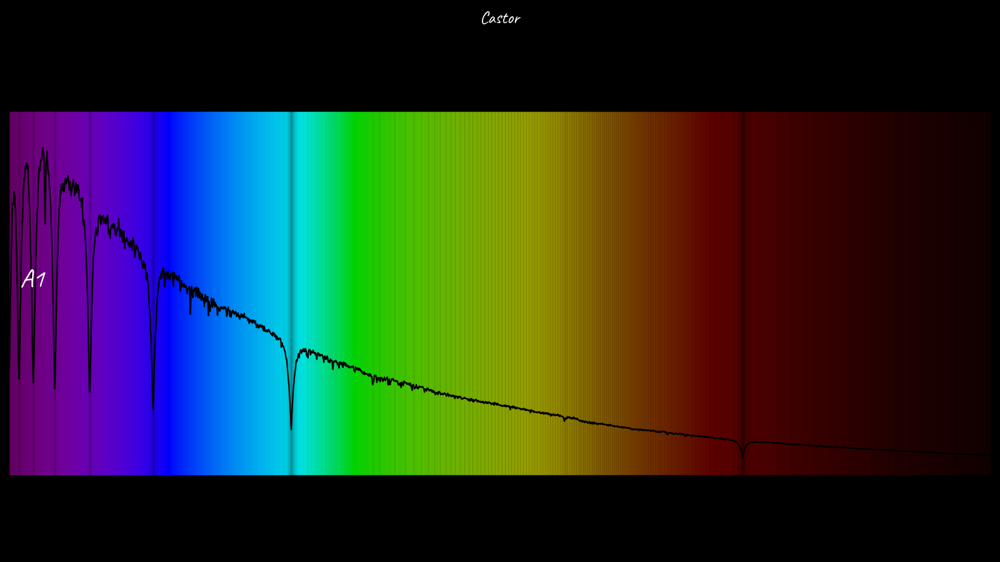

Perfect 👍
Here is a **clean, GitHub-ready `README.md` in English**, written in a professional but approachable style, and aligned with what your code actually does.

You can **copy–paste this directly** into your repository.

---

# 🌈 Stellar Spectrum Image Generator

This project generates **horizontal, photo-style visualizations of stellar spectra** from **FITS files**, transforming spectral flux data into a **physically-based visible light color representation**.

It is designed for **astronomy visualization, science communication, and educational purposes**, producing clean and aesthetically pleasing images directly from real spectral data.

---

## ✨ Features

* Reads stellar spectra from **FITS** files
* Filters the **visible wavelength range** (3800–7500 Å)
* Normalizes spectral flux
* Converts wavelengths to **realistic RGB colors**
* Generates **horizontal 16:9 images** with a black background
* Exports high-quality **PNG images**

---

## 📁 Repository Structure

```text
spectrum_stars_image/
├── src/
│   ├── create_spectrum.py   # Main spectrum generation script
│   ├── utils.py             # FITS reader and wavelength → RGB conversion
│   ├── requirements.txt
│   └── venv/
│
├── data/
│
├── examples/
│   ├── castor_spectrum.fits # Spectrum of the Castor star system
│   ├── castor.png           # Generated spectrum image
│   ├── castor_star.py       # Usage example
│   └── Espectro de estrellas.ipynb
```

---

## 🛠️ Installation

Install the required dependencies:

```bash
pip install -r requirements.txt
```

Main dependencies:

* `numpy`
* `pandas`
* `matplotlib`
* `astropy`

---

## 🚀 Usage

Run the script from the `src/` directory:

```bash
python create_spectrum.py \
  --object_name "Castor" \
  --object_type "Star system" \
  --fits_file "../examples/castor_spectrum.fits"
```

This will generate the output image:

```text
examples/Castor.png
```

---

## ⭐ Example: Castor

**Castor** is a well-known multiple star system in the constellation Gemini.

Using its FITS spectrum, the script produces a visualization where:

* The horizontal axis represents wavelength
* Colors correspond to the **physical visible spectrum**
* Opacity reflects normalized flux intensity
* The spectrum is displayed as a centered horizontal band
* The final output has a **cinematic 16:9 format**



---

## 🧠 Technical Details

* **Visible range:** 3800–7500 Å
* **Color conversion:** physics-based wavelength → RGB approximation
* **Image format:**

  * 16:9 aspect ratio
  * Black background
  * Centered spectral band
* **Output format:** PNG
